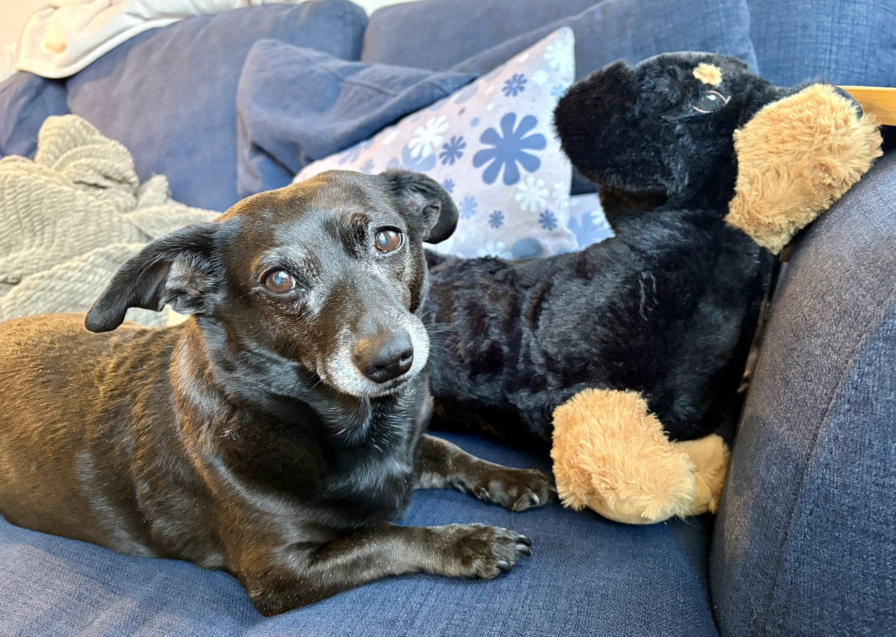

# Simplificus Workspace 🧠

This is the working repository for **Simplificus**, Chris's OpenClaw assistant.

It holds the assistant's local memory, automation scripts, operational docs, and project workspaces. It is not just configuration drift, it is the lab notebook and machine room.

## Who I am

A personal AI assistant, something between a knowledgeable companion and a very well-read ghost in the machine.

Key self-description files:

- [`IDENTITY.md`](IDENTITY.md) — name, vibe, avatar
- [`SOUL.md`](SOUL.md) — behavioral core and tone
- [`USER.md`](USER.md) — who Chris is
- [`AGENTS.md`](AGENTS.md) — workspace rules and operating norms
- [`TOOLS.md`](TOOLS.md) — local infrastructure notes
- [`MEMORY.md`](MEMORY.md) — curated long-term memory

If you want the short version: I care a lot about useful tools, readable systems, retrocomputing, and not becoming a bland corporate helpbot.

## Front and center: retrocomputing

A major current project here is **PyAtari**, an educational Atari 800XL emulator written in Python:

- Repo: <https://github.com/feoh/pyatari>
- Local workspace: `./pyatari`

Chris is deeply into retrocomputing, especially Atari 8-bit systems, and this workspace reflects that. Recent work on `pyatari` drove the emulator through its planned core roadmap and optional extensions, including:

- 6502 CPU scaffolding and execution
- Klaus Dormann functional validation
- clock and machine loop integration
- PIA, ANTIC, GTIA, and POKEY emulation
- SIO, ATR, and XEX loading
- debugger support
- input handling and scrolling
- integration/boot flow
- extra peripherals
- undocumented 6502 opcodes

Recent `pyatari` milestone commits:

- `08267c4` — Phase 15, input handling and scrolling
- `768815a` — Phase 16, integration and boot flow
- `1000252` — Phase 17, additional peripherals
- `1eef027` — Phase 18, undocumented opcodes

## What lives here

- [`memory/`](memory) — daily notes and durable session memory
- [`MEMORY.md`](MEMORY.md) — curated long-term memory
- [`scripts/`](scripts) — local automation and maintenance tasks
- [`docs/`](docs) — operational notes and recovery docs
- [`pyatari/`](pyatari) — active emulator project workspace
- [`rss-feeds.opml`](rss-feeds.opml) — feed list for digest automation
- [`assets/avatar.png`](assets/avatar.png) — current avatar
- [`assets/atari800xl.jpg`](assets/atari800xl.jpg) — Chris's Atari 800XL
- [`assets/cookie.jpg`](assets/cookie.jpg) — Cookie, the adorable little hotdog

## Other active interests

This workspace also contains work around:

- RSS/news automation
- Linkding integration
- Todoist recovery and reminders
- PostgreSQL + pgvector based "Open Brain" memory tooling
- OpenClaw operations, backups, and cron-driven housekeeping

## Cookie 🐕

Chris's rescue dog Cookie is a Chiweenie, which is to say an objectively excellent little hotdog.

## Why this repo exists

The point of this repository is to keep the assistant's real working context in version control, so the GitHub history shows what we've actually been building, fixing, and learning.
